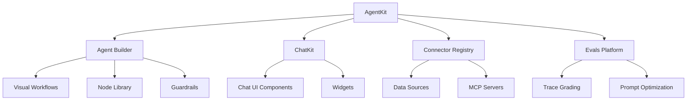
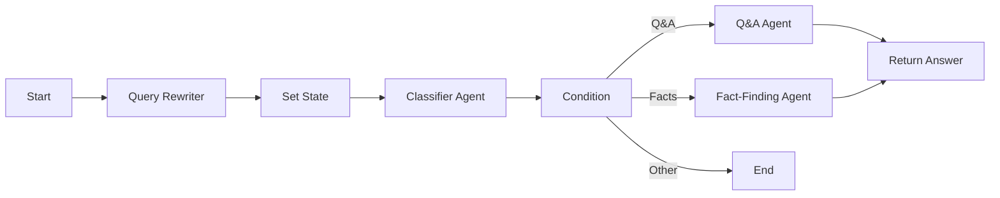
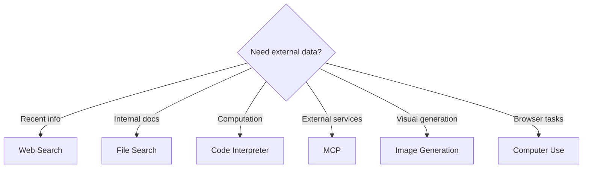
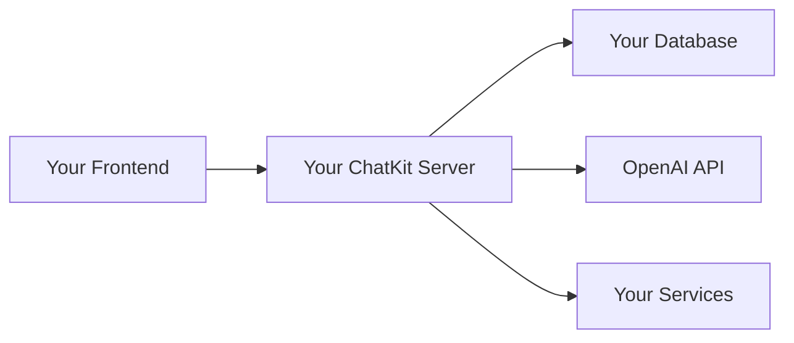
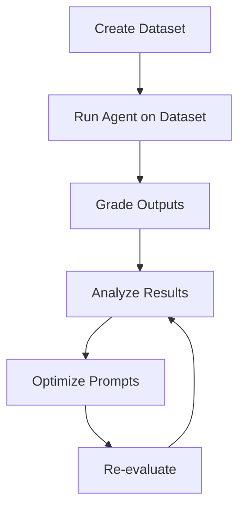

# 🤖 OpenAI Agent Builder: Complete Guide

> A comprehensive guide to building AI agents using OpenAI's visual workflow platform

---

## 📑 Table of Contents

1. [Introduction to OpenAI Agent Builder](#introduction)
2. [What is AgentKit?](#agentkit)
3. [Core Components](#core-components)
4. [Getting Started](#getting-started)
5. [Node Types & Reference](#node-types)
6. [Building Your First Agent](#building-first-agent)
7. [Agent Configuration](#agent-configuration)
8. [Working with Tools](#working-with-tools)
9. [Control Flow & Logic](#control-flow)
10. [Deployment with ChatKit](#deployment)
11. [Evaluation & Optimization](#evaluation)
12. [Best Practices](#best-practices)
13. [Use Cases & Examples](#use-cases)
14. [Resources](#resources)

---

## 🎯 Introduction to OpenAI Agent Builder {#introduction}

**[Screenshot: Title slide - Intro to OpenAI Agent Builder]**

OpenAI Agent Builder is a **visual, no-code platform** launched at DevDay 2025 that allows anyone to design, test, and deploy AI agents through an intuitive drag-and-drop interface. It's part of OpenAI's AgentKit ecosystem.

### Why Agent Builder?

- **Visual Development**: Build complex agentic workflows without writing code
- **Rapid Prototyping**: Go from idea to working agent in hours, not weeks
- **Production-Ready**: Deploy with built-in versioning, guardrails, and monitoring
- **Accessible**: Designed for both technical and non-technical users

### Key Features

✨ **Drag-and-Drop Interface** - Visual canvas for workflow design  
🔄 **Live Preview** - Test agents in real-time before deployment  
📦 **Built-in Tools** - Web search, file search, code interpreter, and more  
🔒 **Safety First** - Guardrails for PII, jailbreaks, and content moderation  
🎨 **Customizable UI** - Deploy with ChatKit for branded experiences  
📊 **Analytics** - Built-in evaluation and performance monitoring

---

## 🛠️ What is AgentKit? {#agentkit}

**[Screenshot: AgentKit Overview]**

AgentKit is OpenAI's complete toolkit for building, deploying, and optimizing AI agents. It consists of several interconnected components:



### AgentKit Components

| Component | Purpose | Status |
|-----------|---------|--------|
| **Agent Builder** | Visual canvas for multi-agent workflows | Beta |
| **ChatKit** | Embeddable chat UI toolkit | GA |
| **Connector Registry** | Centralized data source management | Beta |
| **Evals Platform** | Performance testing and optimization | GA |
| **Agents SDK** | Code-first development (Python/Node/Go) | GA |

**Source**: [OpenAI AgentKit Announcement](https://openai.com/index/introducing-agentkit/)

---

## 🧩 Core Components {#core-components}

### 1. Agent Builder Canvas

**[Screenshot: Agent Builder Interface]**

The Agent Builder provides a clean, intuitive workspace where you can:

- **Drag and drop nodes** to create your workflow
- **Connect nodes** with typed edges (data contracts)
- **Configure properties** with inline documentation
- **Preview runs** in a sandboxed environment
- **Version control** with automatic saving and manual checkpoints

### 2. Workflows

A **workflow** is a combination of:
- **Agents**: LLMs with instructions and tools
- **Tools**: External capabilities (search, files, code, etc.)
- **Control Flow**: Logic for branching, looping, and conditions

### 3. Nodes

**[Screenshot: Node Library]**

Nodes are the building blocks of your agent. Each node represents a step or action in your workflow.

---

## 🚀 Getting Started {#getting-started}

**[Screenshot: Getting Started]**

### Prerequisites

✅ OpenAI account with API access  
✅ Billing configured on your account  
✅ Access to [platform.openai.com/agent-builder](https://platform.openai.com/agent-builder)

### Quick Start

1. **Log in** to OpenAI Platform
2. Navigate to **Agent Builder**
3. Choose **New Workflow** or start from a **Template**
4. Add and configure **nodes**
5. **Connect** nodes to define flow
6. **Preview** your agent
7. **Publish** when ready

### Your First 5 Minutes

```
1. Start Node → Configure inputs
2. Agent Node → Add instructions and select model
3. Set State Node → Store outputs
4. Connect all nodes
5. Click Preview → Test your agent
```

**Source**: [Agent Builder Guide](https://platform.openai.com/docs/guides/agent-builder)

---

## 📦 Node Types & Reference {#node-types}

**[Screenshot: Available Nodes]**

### Foundation Nodes

#### 🟢 Start Node
**Purpose**: Define inputs to your workflow

**[Screenshot: Start Node Configuration]**

- **For Chat Workflows**: Automatically includes `input_as_text` variable
- **State Variables**: Add custom variables for workflow context
- **File Attachments**: Enable file uploads from users

**Configuration**:
```yaml
Variables:
  - input_as_text (default for chat)
  - Custom state variables (optional)
Attachments: Enabled/Disabled
```

#### 🤖 Agent Node
**Purpose**: Core AI reasoning and decision-making

**[Screenshot: Agent Node Configuration]**

The Agent node is where your AI comes to life. Each agent should be:
- **Well-scoped**: Focused on a specific task
- **Well-instructed**: Clear, detailed instructions
- **Tool-equipped**: Relevant tools for the job

**Key Configuration Options**:

| Setting | Description | Options |
|---------|-------------|---------|
| **Instructions** | How the agent should behave | Text prompt or generated |
| **Model** | Which AI model to use | GPT-5, GPT-4o, GPT-5-mini |
| **Reasoning** | Chain-of-thought effort | Minimum, Medium, High |
| **Output Format** | Response structure | Text, JSON, Widgets |
| **Verbosity** | Response length | Low, Medium, High |
| **Chat History** | Include conversation context | On/Off |
| **Tools** | Available capabilities | Multiple selection |

**Example Instructions**:
```
You are a helpful homework assistant specializing in mathematics.
Your role is to:
1. Rewrite student questions for clarity
2. Break down complex problems into steps
3. Provide detailed explanations
4. Encourage independent thinking

Always be encouraging and patient. Use examples when helpful.
```

**Source**: [Node Reference](https://platform.openai.com/docs/guides/node-reference)

---

### Data Nodes

#### 📝 Set State Node
**Purpose**: Define and store global variables

**[Screenshot: Set State Node]**

- **Use Case**: Store agent outputs for use across the workflow
- **Scope**: Variables available to all downstream nodes
- **Example**: Store rewritten query, classification results, user preferences

**Configuration**:
```javascript
{
  "rewritten_query": "{{ agent_output.text }}",
  "user_intent": "{{ classifier.intent }}",
  "confidence": "{{ classifier.score }}"
}
```

#### 🔄 Transform Node
**Purpose**: Reshape data between nodes

**[Screenshot: Transform Node]**

- **Use Cases**:
  - Object → Array conversion
  - Type enforcement
  - Schema compliance
  - Data reformatting

**Example**:
```javascript
// Transform object to array for iteration
Input:  { name: "John", age: 30 }
Output: [["name", "John"], ["age", 30]]
```

---

### Tool Nodes

**[Screenshot: Tool Nodes Overview]**

#### 🔍 Web Search
**Purpose**: Access up-to-date information from the internet

- Built-in OpenAI web search
- Returns cited, reliable results
- Useful for current events, facts, and research

**Configuration**:
```yaml
Query: "{{ rewritten_query }}"
Max Results: 10
```

#### 📁 File Search (Vector Store)
**Purpose**: Retrieve data from uploaded documents

**[Screenshot: File Search Configuration]**

- **Setup**: Upload documents to vector store
- **Supported Formats**: PDF, TXT, DOCX, MD, CSV, and more
- **Query**: Uses semantic search for relevant chunks
- **Use Case**: RAG (Retrieval-Augmented Generation)

**Step-by-Step**:
1. Click **+ Add Tool** → **File Search**
2. Create new vector store or select existing
3. Upload relevant documents
4. Configure query parameters
5. Attach to agent

**Example**:
```yaml
Vector Store ID: vs_abc123
Query: "{{ user_question }}"
Max Chunks: 5
```

**Source**: [File Search Documentation](https://platform.openai.com/docs/guides/file-search)

#### 💻 Code Interpreter
**Purpose**: Execute Python code dynamically

**[Screenshot: Code Interpreter]**

- Run Python code with high accuracy
- Access to data analysis libraries
- Useful for calculations, data processing, plotting

#### 🌐 MCP (Model Context Protocol)
**Purpose**: Connect to external services and APIs

**[Screenshot: MCP Configuration]**

**Model Context Protocol** enables integration with:
- Business apps (Gmail, Slack, Salesforce)
- Custom APIs
- Internal databases
- Third-party services

**Configuration**:
```yaml
MCP Server URL: https://mcp.service.com/sse
Server Name: gmail-mcp
Authentication: OAuth / API Key
Tools Available: [send_email, read_inbox, search_messages]
```

**Popular MCP Servers**:
- 📧 Gmail
- 💼 Asana
- 📊 Google Sheets
- 🗂️ Notion
- 🔗 Custom integrations

**Example: Gmail Integration**
```javascript
MCP Node Configuration:
  Server: gmail-mcp
  Action: send_email
  Parameters:
    to: "{{ email_address }}"
    subject: "{{ email_subject }}"
    body: "{{ email_body }}"
```

**Source**: [MCP Documentation](https://platform.openai.com/docs/guides/connectors)

#### 🛡️ Guardrails Node
**Purpose**: Safety and content moderation

**[Screenshot: Guardrails Configuration]**

**Built-in Checks**:
- ⚠️ PII Detection (personally identifiable information)
- 🚫 Jailbreak Attempts
- 🤥 Hallucination Detection
- 🔞 Content Moderation
- 📝 Custom Rules

**Pass/Fail Logic**:
- **Pass**: Continue to next node
- **Fail**: Route to alternative path (end workflow or retry with reminder)

**Example Flow**:
```
User Input → Guardrails → [Pass] → Agent
                       ↓
                     [Fail] → End with warning message
```

**Configuration**:
```yaml
Checks:
  - PII: Enabled
  - Jailbreak: Enabled
  - Moderation: Enabled
On Failure:
  Action: End workflow
  Message: "Input contains inappropriate content"
```

**Source**: [Guardrails Documentation](https://openai.com/index/introducing-agentkit/)

---

### Control Flow Nodes

**[Screenshot: Control Flow Nodes]**

#### 🔀 Condition Node
**Purpose**: Conditional branching using CEL (Common Expression Language)

**[Screenshot: Condition Node]**

**Use Cases**:
- Route queries based on classification
- Handle different user intents
- Create fallback logic

**Example: Query Routing**
```javascript
// Classification: Q&A vs Fact-Finding
if (classification.type == "qa") {
  // Route to Q&A agent
} else if (classification.type == "fact-finding") {
  // Route to research agent
} else {
  // End workflow
}
```

**CEL Expression**:
```
state.intent == "support" ? "support_path" : 
state.intent == "sales" ? "sales_path" : 
"general_path"
```

#### 🔁 While Loop Node
**Purpose**: Repeat actions until condition is met

**[Screenshot: While Loop]**

**Use Cases**:
- Poll API for status updates
- Retry operations with backoff
- Iterate until quality threshold met

**Example: API Polling**
```javascript
while (api_response.status != "completed") {
  wait(5000); // 5 second delay
  call_api();
}
```

**CEL Expression**:
```
state.retries < 3 && state.status != "success"
```

⚠️ **Important**: Always include exit conditions to prevent infinite loops!

#### ✋ User Approval Node
**Purpose**: Human-in-the-loop workflow

**[Screenshot: User Approval]**

**Use Cases**:
- Review before sending emails
- Approve financial transactions
- Verify automated decisions
- Quality control gates

**Configuration**:
```yaml
Prompt: "Would you like me to send this email?"
Buttons:
  - Approve: Continue workflow
  - Reject: End workflow
  - Edit: Return to previous node
```

**Example Flow**:
```
Draft Email → User Approval → [Approved] → Send Email
                            ↓
                          [Rejected] → End
```

**Source**: [Node Reference](https://platform.openai.com/docs/guides/node-reference)

---

## 🏗️ Building Your First Agent {#building-first-agent}

**[Screenshot: Workflow Example - Homework Helper]**

Let's build a **Homework Helper** agent step-by-step!

### Architecture Overview



### Step-by-Step Build

#### Step 1: Start Node
**[Screenshot: Start Node Setup]**

```yaml
Node: Start (Chat)
Purpose: Accept student questions
Variables:
  - input_as_text: Student's question
  - subject: Optional subject area
Attachments: Enabled (for homework PDFs)
```

#### Step 2: Query Rewriter Agent
**[Screenshot: Query Rewriter]**

```yaml
Node: Agent
Name: Query Rewriter
Model: GPT-5
Instructions: |
  Rewrite the student's question to be:
  1. Clear and specific
  2. Properly structured
  3. Focused on learning, not just answers
  
  Keep the original intent but improve clarity.
  
Output: Rewritten query
```

**Example**:
- Input: "how do i solve that quadratic thing?"
- Output: "What is the step-by-step process for solving a quadratic equation using the quadratic formula?"

#### Step 3: Set State
**[Screenshot: Set State]**

```yaml
Node: Set State
Variables:
  rewritten_query: "{{ query_rewriter.output }}"
Purpose: Store the improved question for downstream use
```

#### Step 4: Classifier Agent
**[Screenshot: Classifier Agent]**

```yaml
Node: Agent
Name: Question Classifier
Model: GPT-5-mini (faster, cheaper for simple tasks)
Output Format: JSON Schema

Instructions: |
  Classify the student's question into one of these types:
  1. "qa" - Direct question with specific answer
  2. "fact-finding" - Requires research or exploration
  3. "other" - Off-topic or unclear
  
JSON Schema:
{
  "type": {
    "type": "string",
    "enum": ["qa", "fact-finding", "other"]
  },
  "confidence": {
    "type": "number",
    "minimum": 0,
    "maximum": 1
  }
}
```

#### Step 5: Conditional Routing
**[Screenshot: Condition Node]**

```javascript
Node: Condition
Expression (CEL):
  state.classification.type == "qa" ? "qa_agent" :
  state.classification.type == "fact-finding" ? "research_agent" :
  "end"

Routes:
  - qa_agent → Direct Q&A Agent
  - research_agent → Fact-Finding Agent
  - end → End workflow with message
```

#### Step 6: Q&A Agent
**[Screenshot: Q&A Agent]**

```yaml
Node: Agent
Name: Q&A Helper
Model: GPT-5
Reasoning: Medium
Tools:
  - File Search (textbooks vector store)
  - Code Interpreter (for math)

Instructions: |
  You are a patient homework helper.
  
  For the given question: "{{ rewritten_query }}"
  
  1. Provide a clear, educational answer
  2. Show your step-by-step reasoning
  3. Explain concepts, don't just give answers
  4. Encourage the student to think critically
  5. Use examples when helpful
  
  Remember: Help them learn, don't do the work for them!

Output: Detailed educational response
```

#### Step 7: Fact-Finding Agent
**[Screenshot: Fact-Finding Agent]**

```yaml
Node: Agent
Name: Research Helper
Model: GPT-5
Tools:
  - Web Search
  - File Search

Instructions: |
  Research the question: "{{ rewritten_query }}"
  
  1. Search for relevant, reliable information
  2. Synthesize findings from multiple sources
  3. Present key facts clearly
  4. Include citations
  5. Suggest follow-up questions for deeper learning
  
  Focus on helping the student understand the topic broadly.

Output: Research summary with sources
```

#### Step 8: Return Response
**[Screenshot: Final Output]**

Both agents output to the user with formatted responses including:
- Main answer/findings
- Step-by-step explanation
- Sources/citations
- Suggested next steps

---

### Complete Workflow Configuration

**[Screenshot: Complete Homework Helper Workflow]**

```yaml
Workflow: Homework Helper
Version: 1.0
Description: Helps students with homework by understanding, 
            classifying, and routing questions appropriately

Nodes: 8
Edges: 7
Estimated Tokens per Run: ~2,000-5,000
Average Response Time: 5-8 seconds

Model Usage:
  - Query Rewriter: GPT-5 (quality)
  - Classifier: GPT-5-mini (speed)
  - Q&A Agent: GPT-5 (reasoning)
  - Research Agent: GPT-5 (depth)
```

---

## ⚙️ Agent Configuration {#agent-configuration}

**[Screenshot: Agent Configuration Panel]**

### Model Selection

**Available Models**:

| Model | Best For | Speed | Cost | Reasoning |
|-------|----------|-------|------|-----------|
| **GPT-5** | Complex tasks, high quality | Medium | $$$ | High |
| **GPT-4o** | Balanced performance | Fast | $$ | Medium |
| **GPT-5-mini** | Simple tasks, classification | Very Fast | $ | Low |

**Decision Framework**:
```
Complex reasoning + Multi-step → GPT-5
Balanced needs + Cost conscious → GPT-4o
Simple classification + Speed → GPT-5-mini
```

### Instructions Best Practices

**[Screenshot: Instructions Examples]**

#### ✅ Good Instructions
```markdown
You are a customer support agent for TechCorp.

Your responsibilities:
1. Understand customer issues clearly
2. Search the knowledge base for solutions
3. Provide step-by-step guidance
4. Escalate to human if unable to resolve

Tone: Professional, empathetic, solution-focused
Constraints: Do not make promises about refunds or 
            changes to account billing

When uncertain, say: "Let me connect you with a 
                     specialist who can help."
```

#### ❌ Poor Instructions
```markdown
Help customers.
```

#### 💡 Pro Tips for Instructions

**[Screenshot: Prompting Tips]**

1. **Be Specific**: Define exact behaviors and boundaries
2. **Use Examples**: Show desired input/output patterns
3. **Set Constraints**: What the agent should NOT do
4. **Define Tone**: Professional, casual, technical, etc.
5. **Handle Edge Cases**: What to do when stuck/uncertain
6. **Structure**: Use numbered lists, sections, clear formatting

**Prompt Generation**: Use the ✏️ icon in Agent Builder to generate instructions from natural language!

**Source**: [OpenAI Prompting Guide](https://platform.openai.com/docs/guides/prompt-engineering)

### Reasoning Levels

**[Screenshot: Reasoning Settings]**

| Level | Use When | Impact |
|-------|----------|--------|
| **Minimum** | Simple tasks, quick responses | Fastest, cheapest |
| **Medium** | Balanced reasoning needs | Good default |
| **High** | Complex problems, critical accuracy | Slowest, best quality |

**Reasoning = Chain-of-Thought**:
- Model "thinks" before answering
- Shows reasoning process
- Higher accuracy on complex tasks
- More tokens used

### Output Formats

**[Screenshot: Output Format Options]**

#### 1. Text Output
```yaml
Format: text
Use: Natural conversation, explanations
Example: "Based on your question, the answer is..."
```

#### 2. JSON Output
```yaml
Format: json
Schema: Define structure
Use: Structured data, API integration

Example Schema:
{
  "answer": { "type": "string" },
  "confidence": { "type": "number" },
  "sources": { "type": "array" }
}
```

#### 3. Widgets (ChatKit)
```yaml
Format: widget
Components: Cards, Forms, Buttons, Lists
Use: Rich interactive UI in chat

Example: Email draft widget with approve/edit buttons
```

### Verbosity Control

**[Screenshot: Verbosity Settings]**

- **Low**: Concise, bullet-point style
- **Medium**: Balanced detail (default)
- **High**: Comprehensive, detailed explanations

**Recommendation**: Start with Medium, adjust based on user feedback.

### Chat History

**[Screenshot: Chat History Toggle]**

**Enabled** ✅:
- Agent remembers conversation context
- Can reference previous exchanges
- Better continuity
- **Cost**: Uses more tokens

**Disabled** ❌:
- Each interaction is independent
- No memory of past conversation
- Lower token usage
- Good for stateless queries

**Best Practice**: Enable for conversational experiences, disable for one-off queries.

---

## 🔧 Working with Tools {#working-with-tools}

**[Screenshot: Tools Overview]**

### Built-in Tools

#### Tool Selection Strategy



### Configuring Multiple Tools

**[Screenshot: Multi-tool Configuration]**

An agent can use multiple tools in a single conversation:

```yaml
Agent: Customer Support
Tools:
  - File Search (knowledge base)
  - Web Search (latest product updates)
  - MCP (CRM integration)
  - Code Interpreter (data analysis)

Behavior: Agent automatically chooses appropriate tool(s)
```

### Tool Usage Patterns

**[Screenshot: Tool Calling Sequence]**

#### Sequential Tool Use
```
User: "Find recent articles about AI and summarize them"
  ↓
1. Web Search → Get articles
2. Agent Reasoning → Analyze content
3. Return → Structured summary
```

#### Parallel Tool Use
```
User: "Check my CRM and search for industry trends"
  ↓
Simultaneously:
- MCP → Query CRM
- Web Search → Find trends
  ↓
Combine results → Comprehensive answer
```

### File Search Deep Dive

**[Screenshot: Vector Store Setup]**

#### Creating a Vector Store

1. **In Agent Builder**:
   ```
   Click Agent → Add Tool → File Search
   → Create New Vector Store
   → Upload Files
   → Name Vector Store
   ```

2. **Supported File Types**:
   - 📄 PDF, TXT, MD, DOCX
   - 📊 CSV, TSV, JSON
   - 💻 Code files (py, js, etc.)
   - 📝 And many more

3. **Chunking Strategy**:
   - Automatic chunking for optimal retrieval
   - Semantic search across chunks
   - Returns top K relevant chunks

#### Best Practices for File Search

**[Screenshot: File Search Best Practices]**

✅ **DO**:
- Upload clean, well-formatted documents
- Use descriptive filenames
- Organize by topic/category
- Update vector store when docs change
- Test queries before deployment

❌ **DON'T**:
- Upload duplicate content
- Mix unrelated documents in same store
- Use poorly scanned PDFs
- Forget to version your vector stores

**Optimization Tips**:
```yaml
1. Document Preparation:
   - Remove headers/footers
   - Clean formatting
   - Add clear section headings

2. Query Design:
   - Use specific, focused queries
   - Leverage rewritten/enhanced queries
   - Combine with agent reasoning

3. Retrieval Tuning:
   - Adjust max_chunks parameter
   - Test different query formats
   - Monitor relevance scores
```

**Source**: [File Search Guide](https://platform.openai.com/docs/guides/file-search)

---

## 🎛️ Control Flow & Logic {#control-flow}

**[Screenshot: Control Flow Patterns]**

### Common Patterns

#### 1. Linear Flow
```
Start → Agent → Transform → Output
```
**Use**: Simple, straightforward tasks

#### 2. Branching Flow
```
Start → Classifier → Condition
                   ├─→ Path A → Agent A
                   ├─→ Path B → Agent B
                   └─→ Path C → End
```
**Use**: Different handling for different inputs

#### 3. Loop Flow
```
Start → Agent → While(condition) → Agent → Output
                       ↓                      ↑
                       └──────────────────────┘
```
**Use**: Iterative improvement, polling, retries

#### 4. Human-in-Loop
```
Start → Agent → Draft → Approval → Send
                          ↓
                       Rejected → Edit → Agent
```
**Use**: Quality control, sensitive operations

### CEL (Common Expression Language)

**[Screenshot: CEL Examples]**

CEL is used in Condition and While nodes for logic.

#### Basic Syntax

```javascript
// Comparisons
state.value == "target"
state.number > 10
state.flag != true

// Logical operators
state.a && state.b
state.x || state.y
!state.condition

// Ternary operator
state.type == "A" ? "path_a" : "path_b"

// Array operations
state.items.size() > 0
"keyword" in state.text

// String operations
state.name.startsWith("Dr.")
state.email.contains("@company.com")
```

#### Complex Conditions

```javascript
// Multi-condition routing
state.confidence > 0.8 && state.type == "urgent" ? "priority" :
state.confidence > 0.5 ? "normal" :
"low_priority"

// Range checking
state.age >= 18 && state.age <= 65

// Pattern matching
state.status in ["pending", "processing", "review"]
```

### Error Handling

**[Screenshot: Error Handling Patterns]**

#### Retry Logic
```yaml
Node: While Loop
Condition: state.retries < 3 && !state.success

Inside Loop:
  1. Attempt Operation
  2. Check Result
  3. Increment Retries
  4. Continue if failed
```

#### Fallback Paths
```yaml
Node: Condition
Expression: state.api_response.status == "success"

Paths:
  - Success: Continue workflow
  - Failure: Fallback Agent (handle error gracefully)
```

#### Timeout Handling
```javascript
// Use While loop with iteration counter
state.iterations < 10 && state.status != "completed"

// Add delay between iterations
// Handled automatically by Agent Builder
```

**Best Practice**: Always include maximum iteration limits to prevent infinite loops!

---

## 🚀 Deployment with ChatKit {#deployment}

**[Screenshot: ChatKit Deployment]**

### What is ChatKit?

**ChatKit** is OpenAI's front-end toolkit for embedding chat-based agents into your applications.

**Key Features**:
- 🎨 Customizable themes and branding
- 💬 Real-time streaming responses
- 🧵 Conversation thread management
- 🎯 Rich UI widgets (cards, forms, buttons)
- 📁 File attachment support
- 🔐 Built-in authentication

### Deployment Options

**[Screenshot: Deployment Options]**

#### Option 1: OpenAI-Hosted (Recommended)

**[Screenshot: Hosted Deployment]**

✅ **Advantages**:
- Simplest setup (embed in minutes)
- OpenAI handles scaling and infrastructure
- Automatic updates
- Built-in security

**Setup Steps**:
1. Publish your Agent Builder workflow
2. Get Workflow ID from "Code" tab
3. Add ChatKit script to your page
4. Configure with Workflow ID
5. Deploy!

**Code Example**:
```html
<!DOCTYPE html>
<html>
<head>
  <script src="https://cdn.platform.openai.com/deployments/chatkit/chatkit.js" async></script>
</head>
<body>
  <openai-chatkit id="my-chat"></openai-chatkit>
  
  <script>
    const chatkit = document.getElementById('my-chat');
    chatkit.setOptions({
      api: {
        async getClientSecret(currentClientSecret) {
          // Call your server to get client secret
          const res = await fetch('/api/chatkit/start', {
            method: 'POST'
          });
          const { client_secret } = await res.json();
          return client_secret;
        }
      }
    });
  </script>
</body>
</html>
```

**Server-Side (Node.js)**:
```javascript
import OpenAI from 'openai';

const openai = new OpenAI();

app.post('/api/chatkit/start', async (req, res) => {
  const session = await openai.chatkit.sessions.create({
    workflow: { id: 'your-workflow-id' },
    user: 'user-123'
  });
  
  res.json({ client_secret: session.client_secret });
});
```

**Source**: [ChatKit Guide](https://platform.openai.com/docs/guides/chatkit)

#### Option 2: Self-Hosted (Advanced)

**[Screenshot: Self-Hosted Setup]**

✅ **When to Use**:
- Custom authentication requirements
- Data residency requirements
- On-premise deployment
- Custom agent orchestration
- Full infrastructure control

**Architecture**:


**Setup Steps**:
1. Clone ChatKit Python SDK
2. Implement ChatKitServer class
3. Add storage backend (database)
4. Deploy on your infrastructure
5. Connect frontend widgets

**Example Server**:
```python
from fastapi import FastAPI
from chatkit.server import ChatKitServer
from chatkit.store import SQLiteStore

app = FastAPI()
store = SQLiteStore()
server = ChatKitServer(store)

@app.post("/chatkit")
async def chatkit_endpoint(request: Request):
    result = await server.process(await request.body())
    if isinstance(result, StreamingResult):
        return StreamingResponse(result)
    return Response(content=result.json)
```

**Source**: [Advanced ChatKit Integration](https://platform.openai.com/docs/guides/custom-chatkit)

### ChatKit Features

**[Screenshot: ChatKit Features]**

#### Widgets

Create rich, interactive UI components:

```javascript
// Card Widget
{
  type: "card",
  title: "Draft Email",
  children: [
    { type: "text", value: email_content },
    { type: "button", label: "Send", action: "send" },
    { type: "button", label: "Edit", action: "edit" }
  ]
}

// Form Widget
{
  type: "form",
  fields: [
    { type: "input", name: "name", label: "Your Name" },
    { type: "select", name: "category", options: [...] },
    { type: "textarea", name: "message" }
  ],
  submit: "Submit"
}

// List Widget
{
  type: "list",
  items: [
    { title: "Item 1", subtitle: "Description" },
    { title: "Item 2", subtitle: "Description" }
  ]
}
```

**[Screenshot: Widget Examples]**

#### Themes & Customization

```javascript
chatkit.setOptions({
  theme: {
    primaryColor: '#0066FF',
    backgroundColor: '#FFFFFF',
    fontFamily: 'Inter, sans-serif',
    borderRadius: '8px'
  }
});
```

#### File Attachments

```javascript
chatkit.setOptions({
  attachments: {
    enabled: true,
    maxSize: 10 * 1024 * 1024, // 10MB
    allowedTypes: ['image/*', 'application/pdf']
  }
});
```

### Domain Allowlist (CRITICAL) ⚠️

**[Screenshot: Domain Configuration]**

**Before your ChatKit widget will render**, you must add your domain to the allowlist:

1. Go to **OpenAI Platform** → **Settings**
2. Navigate to **Organization Settings**
3. Add your domain(s) to **Allowed Domains**
   - Development: `http://localhost:3000`
   - Staging: `https://staging.yourapp.com`
   - Production: `https://yourapp.com`

**Why This Matters**:
- Security feature to prevent unauthorized embedding
- Widget won't render without proper configuration
- Most common deployment issue for first-time users

**Source**: [ChatKit Setup Guide](https://medium.com/@mcraddock/getting-started-with-openai-chatkit-the-one-setup-step-you-cant-skip-7d4c0110404a)

### Real-World Examples

**[Screenshot: ChatKit Examples]**

**Companies Using ChatKit**:

1. **Canva** - Developer documentation assistant
   - Integration time: < 1 hour
   - Result: Conversational docs experience

2. **HubSpot** - Customer support agent
   - Use case: Internal knowledge assistant
   - Result: Faster support resolution

3. **LegalOn** - Research agent
   - Use case: Legal document analysis
   - Result: Enhanced productivity

4. **Ramp** - Buyer agent
   - Built in: Few hours (vs months previously)
   - Result: 70% faster iteration cycles

**Source**: [AgentKit Case Studies](https://openai.com/index/introducing-agentkit/)

---

## 📊 Evaluation & Optimization {#evaluation}

**[Screenshot: Evals Platform]**

### Why Evaluate?

Building reliable agents requires rigorous testing:
- ✅ Verify accuracy and quality
- ✅ Catch edge cases and errors
- ✅ Optimize prompts systematically
- ✅ Monitor production performance
- ✅ Improve over time with data

### OpenAI Evals Platform

**[Screenshot: Evals Dashboard]**

**Key Features**:
- 📋 **Datasets**: JSONL format test cases
- 🎯 **Trace Grading**: Evaluate full workflow runs
- 🤖 **Model Graders**: Automated quality assessment
- 📈 **Prompt Optimization**: Auto-improve instructions
- 🔍 **Third-Party Models**: Test with different models

### Evaluation Workflow

**[Screenshot: Evaluation Process]**



### Creating Datasets

**[Screenshot: Dataset Creation]**

**Format**: JSONL (JSON Lines)

```jsonl
{"input": "What is the capital of France?", "expected_output": "Paris", "metadata": {"difficulty": "easy"}}
{"input": "Explain quantum entanglement", "expected_output": "...", "metadata": {"difficulty": "hard"}}
{"input": "Book a flight to NYC", "expected_output": "...", "metadata": {"category": "booking"}}
```

**Best Practices**:
- Include diverse examples
- Cover edge cases
- Add metadata for segmentation
- Maintain expected outputs
- Regularly update with production data

### Trace Grading

**[Screenshot: Trace Grading]**

**Trace** = Complete execution of your workflow

**Grading Options**:
1. **Human Review**: Manual quality assessment
2. **Model Grader**: LLM evaluates outputs
3. **Rules-Based**: Automated checks (regex, keywords)
4. **Hybrid**: Combine multiple methods

**Example Model Grader**:
```yaml
Grader Prompt:
"Evaluate this customer support response on:
1. Accuracy (1-5)
2. Helpfulness (1-5)
3. Tone appropriateness (1-5)
4. Completeness (1-5)

Provide scores and brief justification."
```

### Prompt Optimization

**[Screenshot: Prompt Optimization]**

**Automatic Prompt Improvement**:
1. Select an agent node
2. Click "Evaluate"
3. Choose dataset
4. Run optimization
5. Review suggested improvements
6. Click "Update" to apply

**What it does**:
- Analyzes failure patterns
- Generates improved instructions
- Tests new prompt on dataset
- Shows before/after comparison

**Example**:
```yaml
Before:
"Answer customer questions"

After (Optimized):
"You are a customer support specialist for TechCorp.
When answering questions:
1. First, acknowledge the customer's concern
2. Search the knowledge base for relevant information
3. Provide clear, step-by-step guidance
4. Confirm understanding before ending
If unable to help, escalate to human support."
```

### Performance Metrics

**[Screenshot: Metrics Dashboard]**

**Track**:
- ⏱️ **Response Time**: Average time per query
- 🎯 **Accuracy**: % of correct responses
- 💰 **Token Usage**: Cost per interaction
- 😊 **User Satisfaction**: Ratings and feedback
- 🔁 **Retry Rate**: How often workflows fail
- 🚨 **Error Rate**: Exceptions and failures

### Continuous Improvement

**[Screenshot: Optimization Loop]**

```
1. Deploy Agent
     ↓
2. Collect Production Data
     ↓
3. Create Evaluation Dataset
     ↓
4. Run Evals & Grade
     ↓
5. Identify Weaknesses
     ↓
6. Optimize Prompts/Tools
     ↓
7. Re-deploy
     ↓
(Repeat)
```

**Source**: [AgentKit Cookbook - Evals](https://cookbook.openai.com/examples/agentkit/agentkit_walkthrough)

---

## 🎯 Best Practices {#best-practices}

**[Screenshot: Best Practices]**

### Workflow Design

#### ✅ DO

1. **Start Simple, Then Scale**
   ```
   V1: Single agent workflow
   V2: Add conditional routing
   V3: Add specialized sub-agents
   V4: Add guardrails and evals
   ```

2. **One Agent, One Job**
   - Each agent should have a clear, focused purpose
   - Avoid "god agents" that do everything
   - Use handoffs between specialized agents

3. **Use Templates**
   - Start with pre-built templates
   - Customize for your use case
   - Learn from working examples

4. **Test Iteratively**
   - Test early and often with Preview
   - Use real user queries
   - Iterate based on failures

5. **Version Your Workflows**
   - Publish versions as snapshots
   - Test new versions before deploying
   - Maintain rollback capability

#### ❌ DON'T

1. **Don't Skip Guardrails**
   - Always add safety checks
   - Test for adversarial inputs
   - Monitor for misuse

2. **Don't Over-Complicate**
   - Keep workflows as simple as possible
   - Add complexity only when needed
   - Fewer nodes = easier to debug

3. **Don't Ignore Costs**
   - Monitor token usage
   - Use cheaper models where appropriate
   - Optimize prompts for efficiency

4. **Don't Forget Edge Cases**
   - Test unusual inputs
   - Handle ambiguity gracefully
   - Provide fallback logic

5. **Don't Deploy Without Evals**
   - Always evaluate before production
   - Set quality thresholds
   - Monitor post-deployment performance

### Agent Instructions

**[Screenshot: Instruction Guidelines]**

#### Structure

```markdown
# Role
You are [specific role] for [context].

# Responsibilities
1. [Primary task]
2. [Secondary task]
3. [Supporting task]

# Constraints
- Do NOT [forbidden action]
- Always [required behavior]
- If uncertain, [fallback behavior]

# Tone
[Professional/Casual/Technical/Empathetic]

# Output Format
[Specific format requirements]
```

#### Examples

Include input/output examples in instructions:

```markdown
Example 1:
Input: "How do I reset my password?"
Output: "I can help you reset your password! Please follow these steps:
1. Go to the login page
2. Click 'Forgot Password'
3. Enter your email address
4. Check your email for reset link
5. Follow the link to create new password

Let me know if you need any clarification!"

Example 2:
Input: "I'm frustrated with this issue"
Output: "I understand your frustration, and I'm here to help. Let's work together to resolve this issue..."
```

### Tool Selection

**[Screenshot: Tool Selection Matrix]**

| Task | Recommended Tool | Why |
|------|-----------------|-----|
| Recent news/events | Web Search | Always current |
| Company knowledge | File Search | Internal docs |
| Calculations | Code Interpreter | Accurate math |
| External integrations | MCP | API access |
| Safety checks | Guardrails | Built-in protection |
| Image creation | Image Generation | Visual content |
| Browser tasks | Computer Use | Web automation |

### Performance Optimization

**[Screenshot: Optimization Tips]**

1. **Model Selection**
   ```
   Classifier → GPT-5-mini (fast, cheap)
   Simple tasks → GPT-4o (balanced)
   Complex reasoning → GPT-5 (quality)
   ```

2. **Prompt Engineering**
   - Be specific and clear
   - Use structured formats
   - Include examples
   - Set clear constraints
   - Test and iterate

3. **Token Optimization**
   - Minimize chat history when possible
   - Use efficient output formats
   - Avoid redundant context
   - Compress long documents

4. **Caching**
   - Reuse vector stores
   - Cache common queries
   - Store intermediate results

### Security & Safety

**[Screenshot: Security Checklist]**

✅ **Essential Security Measures**:

1. **Input Validation**
   - Guardrails for PII detection
   - Jailbreak prevention
   - Content moderation

2. **Output Filtering**
   - Check generated content
   - Prevent sensitive data leakage
   - Verify accuracy before actions

3. **Access Control**
   - Authenticate users
   - Role-based permissions
   - Audit logging

4. **Data Privacy**
   - Don't store sensitive data unnecessarily
   - Comply with regulations (GDPR, etc.)
   - Secure file storage

5. **Rate Limiting**
   - Prevent abuse
   - Manage costs
   - Ensure fair usage

### Debugging & Troubleshooting

**[Screenshot: Debugging Tools]**

**Common Issues & Solutions**:

| Issue | Cause | Solution |
|-------|-------|----------|
| Agent not responding | Missing connections | Check all edges connected |
| Incorrect output format | Wrong output type | Verify JSON schema |
| Slow performance | Too much chat history | Reduce context window |
| High costs | Inefficient prompts | Optimize instructions |
| Guardrails blocking | Too strict rules | Adjust thresholds |
| Tool not working | Missing configuration | Verify tool setup |

**Debugging Steps**:
1. Use **Preview** to test in real-time
2. Check **Logs** for error messages
3. Verify **Node configurations** one by one
4. Test with **simple inputs** first
5. Add **logging nodes** to track data flow

**Source**: [Building Agents - Best Practices](https://cdn.openai.com/business-guides-and-resources/a-practical-guide-to-building-agents.pdf)

---

## 💡 Use Cases & Examples {#use-cases}

**[Screenshot: Use Cases Overview]**

### Customer Support

**[Screenshot: Customer Support Agent]**

**Architecture**:
```
User Query → Intent Classifier → Route to:
  - FAQ Agent (simple questions)
  - Technical Support Agent (complex issues)
  - Sales Agent (pre-sales inquiries)
  - Escalation (human handoff)
```

**Tools**:
- File Search (knowledge base)
- MCP (CRM integration)
- Guardrails (safety checks)
- User Approval (escalation)

**Benefits**:
- 24/7 availability
- Instant responses
- Consistent quality
- Reduced wait times
- Cost savings

**Real Example**: HubSpot's support agent

---

### Research Assistant

**[Screenshot: Research Assistant]**

**Workflow**:
```
Topic → Web Search → Aggregate Results → Analyze
     → File Search → Extract Insights  → Synthesize
     → Code Interpreter → Visualize Data → Report
```

**Capabilities**:
- Multi-source research
- Citation tracking
- Data analysis
- Visualization
- Report generation

**Use Cases**:
- Academic research
- Market analysis
- Competitive intelligence
- Trend analysis
- Literature reviews

---

### Content Creation

**[Screenshot: Content Creator Agent]**

**Process**:
```
Brief → Research → Outline → Draft → Review → Polish
                      ↓
               (Image Generation)
                      ↓
               Format → Publish
```

**Applications**:
- Blog posts
- Social media content
- Marketing copy
- Technical documentation
- Email campaigns

**Tools**:
- Web Search (research)
- Image Generation (visuals)
- File Search (brand guidelines)
- Code Interpreter (data visualization)

---

### Data Analysis

**[Screenshot: Data Analysis Agent]**

**Workflow**:
```
Upload Data → Clean → Analyze → Visualize → Insights
                        ↓
                  (Code Interpreter)
                        ↓
                Generate Reports
```

**Capabilities**:
- Statistical analysis
- Data visualization
- Trend identification
- Anomaly detection
- Predictive modeling

**Use Cases**:
- Business intelligence
- Financial analysis
- Scientific research
- Marketing analytics
- Operations optimization

---

### Workflow Automation

**[Screenshot: Automation Examples]**

**Examples**:

1. **Email Automation**
   ```
   Inbox Monitoring → Classify → Route:
     - Urgent → Immediate Response
     - Routine → Auto-reply
     - Complex → Draft + Human Review
   ```

2. **Task Management**
   ```
   Meeting Notes → Extract Action Items → Create Tasks
                                       → Assign → Notify
                                       → Track → Follow-up
   ```

3. **Lead Qualification**
   ```
   New Lead → Research → Enrich Data → Score
                                    → Route to Sales
                                    → CRM Update
   ```

**Tools**:
- MCP (integrations)
- Code Interpreter (processing)
- File Search (context)
- While Loop (monitoring)

---

### Education & Training

**[Screenshot: Educational Agent]**

**Types**:

1. **Homework Helper** (shown earlier)
2. **Language Tutor**
   ```
   Practice Conversation → Correct Errors
                        → Explain Grammar
                        → Provide Examples
                        → Track Progress
   ```

3. **Skill Assessment**
   ```
   Quiz Generation → Administer Test
                  → Grade Responses
                  → Identify Gaps
                  → Recommend Resources
   ```

**Benefits**:
- Personalized learning
- Instant feedback
- 24/7 availability
- Adaptive difficulty
- Progress tracking

---

### Internal Knowledge Base

**[Screenshot: Knowledge Base Agent]**

**Query Types**:
- "How do I...?" (Procedures)
- "What is...?" (Definitions)
- "Where can I find...?" (Resources)
- "Who handles...?" (Contacts)

**Tools**:
- File Search (company docs)
- MCP (internal systems)
- Web Search (external resources)

**Features**:
- Conversational interface
- Context-aware responses
- Multi-document synthesis
- Citation tracking

**Example**: LY Corporation's work assistant (built in < 2 hours)

---

### Sales & Lead Generation

**[Screenshot: Sales Agent]**

**Workflow**:
```
Lead Capture → Qualify → Enrich → Personalize
                                → Engage
                                → Schedule
                                → Handoff
```

**Capabilities**:
- Lead qualification
- Company research
- Personalized outreach
- Meeting scheduling
- CRM integration

**Tools**:
- MCP (CRM, calendar)
- Web Search (company info)
- File Search (sales materials)
- Code Interpreter (scoring)

**Example**: Ramp's buyer agent

---

### More Use Cases

**[Screenshot: Additional Use Cases]**

- 🏥 **Healthcare**: Patient triage, appointment scheduling, symptom checking
- 💰 **Finance**: Expense tracking, budget analysis, invoice processing
- 🏗️ **Project Management**: Status updates, resource allocation, risk assessment
- 🎯 **Marketing**: Campaign optimization, A/B testing, performance tracking
- 🔐 **Compliance**: Policy checking, audit support, documentation review
- 🌐 **Translation**: Multi-language support, cultural adaptation
- 📱 **Mobile Apps**: In-app assistants, onboarding guides
- 🎮 **Gaming**: NPC dialogue, quest generation, game master

**Key Insight**: Agent Builder works for ANY task that involves:
1. Understanding input
2. Making decisions
3. Taking actions
4. Providing output

**Source**: [AgentKit Use Cases](https://openai.com/agent-platform/)

---

## 📚 Resources {#resources}

**[Screenshot: Resources]**

### Official Documentation

📖 **Primary Resources**:
- [Agent Builder Guide](https://platform.openai.com/docs/guides/agent-builder) - Complete documentation
- [Node Reference](https://platform.openai.com/docs/guides/node-reference) - All available nodes
- [ChatKit Guide](https://platform.openai.com/docs/guides/chatkit) - Deployment documentation
- [AgentKit Announcement](https://openai.com/index/introducing-agentkit/) - Product launch details
- [Responses API](https://platform.openai.com/docs/guides/responses) - Core API
- [Agents SDK](https://openai.github.io/openai-agents-python/) - Code-first development

### Tutorials & Guides

📝 **Learning Resources**:
- [AgentKit Cookbook](https://cookbook.openai.com/examples/agentkit/agentkit_walkthrough) - End-to-end walkthrough
- [Building Agents Guide](https://developers.openai.com/tracks/building-agents/) - Comprehensive course
- [Practical Guide to Building Agents (PDF)](https://cdn.openai.com/business-guides-and-resources/a-practical-guide-to-building-agents.pdf) - Best practices
- [OpenAI Community Forum](https://community.openai.com/) - Ask questions, share projects

### Video Resources

🎥 **Watch & Learn**:
- [Agent Builder Introduction by Christina Huang](https://community.openai.com/t/how-to-get-started-with-agent-builder/1361280) - Official walkthrough
- [DevDay 2025 Keynote](https://openai.com/index/introducing-agentkit/) - Product announcement
- [Build Hour: Agentic Tool Calling](https://developers.openai.com/tracks/building-agents/) - Deep dive

### Community Content

✍️ **Blog Posts & Articles**:
- [Composio: OpenAI Agent Builder Guide](https://composio.dev/blog/openai-agent-builder-step-by-step-guide-to-building-ai-agents-with-mcp) - Detailed tutorial
- [Composio: ChatKit Deployment](https://composio.dev/blog/openai-chatkit) - Step-by-step deployment
- [Medium: OpenAI Agent Builder Complete Guide](https://dibishks.medium.com/openai-agent-builder-a-complete-guide-to-building-ai-workflows-without-code-edd4cecd1beb) - Beginner-friendly
- [Medium: Step-by-Step Guide for Beginners](https://medium.com/@genai.works/openai-agent-builder-a-step-by-step-guide-for-beginners-f2047aca589d) - Getting started
- [Generect: 2025 Guide](https://generect.com/blog/openai-agent-builder/) - Comprehensive walkthrough

### Code Repositories

💻 **GitHub Resources**:
- [chatkit-js](https://github.com/openai/chatkit-js) - JavaScript SDK
- [chatkit-python](https://github.com/openai/chatkit-python) - Python SDK
- [openai-agents-python](https://github.com/openai/openai-agents-python) - Agents SDK
- [ChatKit Starter Template](https://github.com/openai/chatkit-starter) - Quick start

### Tools & SDKs

🛠️ **Development Tools**:
- **Agents SDK**: Python/Node/Go libraries for code-first development
- **ChatKit**: Frontend framework for chat interfaces
- **OpenAI API**: Direct API access for custom implementations
- **Widget Builder**: Interactive UI for creating widgets
- **MCP Protocol**: Connect to external services

### Related Technologies

🔗 **Complementary Tools**:
- **n8n**: Visual automation platform (similar to Agent Builder)
- **Langchain**: Framework for LLM applications
- **Model Context Protocol (MCP)**: Standard for tool integration
- **Vector Databases**: Pinecone, Weaviate, Milvus for RAG

### Pricing

💰 **Cost Information**:
- Agent Builder: **Free** (included in API pricing)
- ChatKit: **Free** (included in API pricing)
- Evals: **Free** (included in API pricing)
- **Usage Costs**: Based on:
  - Model selection (GPT-5, GPT-4o, GPT-5-mini)
  - Tokens consumed
  - Tool usage (web search, file search, etc.)

**Pricing Calculator**: [OpenAI Pricing](https://openai.com/api/pricing/)

### Support

🆘 **Get Help**:
- [OpenAI Community Forum](https://community.openai.com/) - Ask questions
- [Platform Status](https://status.openai.com/) - Service status
- [API Documentation](https://platform.openai.com/docs) - Technical reference
- [Discord Community](https://discord.gg/openai) - Real-time chat
- [Twitter/X: @OpenAI](https://twitter.com/openai) - Updates and announcements

### Stay Updated

📰 **Follow Along**:
- [OpenAI Blog](https://openai.com/blog) - Product updates
- [Changelog](https://platform.openai.com/docs/changelog) - API changes
- [Newsletter](https://openai.com/newsletter) - Monthly digest
- [YouTube](https://www.youtube.com/@OpenAI) - Video content

---

## 🎓 Key Takeaways

**[Screenshot: Summary Slide]**

### What You've Learned

1. ✅ **Agent Builder Basics**
   - Visual, no-code platform for building AI agents
   - Part of OpenAI's AgentKit ecosystem
   - Drag-and-drop interface with nodes and connections

2. ✅ **Core Components**
   - Foundation nodes (Start, Agent)
   - Tool nodes (Web Search, File Search, MCP, Guardrails)
   - Control flow nodes (Condition, While, User Approval)
   - Data nodes (Set State, Transform)

3. ✅ **Building Workflows**
   - Start with templates or blank canvas
   - Connect nodes to create logic flow
   - Configure each node's properties
   - Test with Preview feature
   - Publish versions for deployment

4. ✅ **Deployment**
   - ChatKit for embedded chat experiences
   - OpenAI-hosted or self-hosted options
   - Customizable themes and widgets
   - Production-ready with security features

5. ✅ **Optimization**
   - Evals platform for testing
   - Trace grading for quality assessment
   - Automatic prompt optimization
   - Continuous improvement loop

### Next Steps

🚀 **Start Building**:
1. Log in to [Agent Builder](https://platform.openai.com/agent-builder)
2. Pick a use case (start simple!)
3. Build your first workflow
4. Test thoroughly with Preview
5. Deploy with ChatKit
6. Iterate based on feedback

💡 **Best Practices to Remember**:
- Start simple, then scale
- One agent, one job
- Always add guardrails
- Test with real queries
- Optimize continuously
- Monitor production performance

🎯 **Join the Community**:
- Share your builds
- Learn from others
- Ask questions
- Contribute to discussions
- Stay updated on new features

---

## 📊 Quick Reference

### Agent Builder Cheat Sheet

**[Screenshot: Quick Reference Card]**

```markdown
## Common Patterns

Linear Flow:
Start → Agent → Output

Branching:
Start → Classifier → Condition → [Agent A | Agent B]

Loop:
Start → Agent → While(condition) → Agent → Output

Human-in-Loop:
Start → Agent → User Approval → [Continue | Reject]

## CEL Quick Reference

Comparisons:    ==, !=, <, >, <=, >=
Logical:        &&, ||, !
Ternary:        condition ? true_value : false_value
Strings:        .startsWith(), .contains(), .endsWith()
Arrays:         .size(), in
Objects:        .field

## Model Selection

Simple tasks:     GPT-5-mini
Balanced:         GPT-4o
Complex:          GPT-5

## Common Tools

Current info:     Web Search
Internal docs:    File Search
Calculations:     Code Interpreter
External APIs:    MCP
Safety:           Guardrails

## Performance Tips

- Minimize chat history
- Use cheaper models when possible
- Optimize prompts
- Cache common queries
- Monitor token usage

## Debugging

- Use Preview extensively
- Check all node connections
- Verify tool configurations
- Test edge cases
- Review logs for errors
```

---

## 🙏 Acknowledgments

**Created with information from**:
- [OpenAI Official Documentation](https://platform.openai.com/docs)
- [AgentKit Announcement](https://openai.com/index/introducing-agentkit/)
- [Agent Builder Guide](https://platform.openai.com/docs/guides/agent-builder)
- [ChatKit Documentation](https://platform.openai.com/docs/guides/chatkit)
- [OpenAI Community](https://community.openai.com/)
- [AgentKit Cookbook](https://cookbook.openai.com/examples/agentkit/)

**Additional Resources**:
- Composio Blog Posts
- Medium Articles by GenAI.works, Dibeesh KS, Sharadsisodiya
- Generect Guide
- DEV Community Posts

---

## 📝 Appendix

### Glossary

**[Screenshot: Terms & Definitions]**

- **Agent**: AI system equipped with instructions, tools, and decision-making capabilities
- **Workflow**: Sequence of nodes and connections defining agent behavior
- **Node**: Building block representing a step or action in workflow
- **Edge**: Connection between nodes showing data flow
- **State**: Global variables accessible across workflow
- **Tool**: External capability (search, files, code, APIs)
- **Guardrails**: Safety checks for inputs and outputs
- **MCP**: Model Context Protocol for external integrations
- **ChatKit**: Frontend framework for chat interfaces
- **Evals**: Evaluation and testing platform
- **Trace**: Complete execution record of a workflow run
- **Vector Store**: Database for semantic search of documents
- **CEL**: Common Expression Language for conditions
- **Widget**: Rich UI component in chat interface

### FAQ

**[Screenshot: Frequently Asked Questions]**

**Q: Do I need to know how to code?**
A: No! Agent Builder is designed for visual, no-code development. However, coding knowledge helps for advanced customization and self-hosted deployments.

**Q: What's the difference between Agent Builder and the Agents SDK?**
A: Agent Builder is visual/no-code. Agents SDK is code-first (Python/Node/Go). Choose based on preference and requirements.

**Q: Can I export my workflow as code?**
A: Yes! Click "Code" in Agent Builder to get implementation code for ChatKit or Agents SDK.

**Q: How much does it cost?**
A: Agent Builder, ChatKit, and Evals are free. You pay only for model usage (tokens) and tool usage.

**Q: Can I use my own models?**
A: For hosted Agent Builder, you use OpenAI models. For custom implementations with Agents SDK, you can use other providers.

**Q: Is my data secure?**
A: OpenAI does not train models on your business data by default. Enterprise customers can add additional security controls.

**Q: How do I handle sensitive data?**
A: Use Guardrails for PII detection, implement proper access controls, and follow data privacy best practices.

**Q: Can I A/B test different workflows?**
A: Yes! Use versioning to maintain multiple workflow variants and route traffic accordingly.

**Q: What's the maximum workflow complexity?**
A: No hard limits, but simpler workflows are easier to maintain. Start simple and scale as needed.

**Q: Can I integrate with my existing systems?**
A: Yes! Use MCP nodes to connect to external APIs, databases, and services.

---

## 🎉 Conclusion

**[Screenshot: Final Slide]**

OpenAI Agent Builder democratizes AI agent development, making it accessible to everyone—from developers to business users. With its visual interface, powerful tools, and production-ready deployment options, you can go from idea to deployed agent in hours instead of weeks.

**The Future is Agentic**  
Agents will become integral to how we work, creating new possibilities for automation, assistance, and augmentation across every industry.

**Start Building Today**  
Visit [platform.openai.com/agent-builder](https://platform.openai.com/agent-builder) and create your first agent!

---

**Document Information**:
- **Title**: OpenAI Agent Builder - Complete Guide
- **Version**: 1.0
- **Date**: December 2025
- **Author**: Based on OpenAI Documentation and Community Resources
- **Source**: Comprehensive compilation from official docs, tutorials, and guides

---

*This guide is a comprehensive educational resource based on publicly available information about OpenAI's Agent Builder. For the most up-to-date information, always refer to the [official OpenAI documentation](https://platform.openai.com/docs).*

---

**🔗 Quick Links**

- [Agent Builder](https://platform.openai.com/agent-builder)
- [Documentation](https://platform.openai.com/docs/guides/agent-builder)
- [Community Forum](https://community.openai.com/)
- [Pricing](https://openai.com/api/pricing/)
- [AgentKit](https://openai.com/agent-platform/)

---

**📧 Feedback**

Have suggestions or corrections? Open an issue or submit a pull request to improve this guide!

---

**⭐ If you found this guide helpful, please star the repository!**
